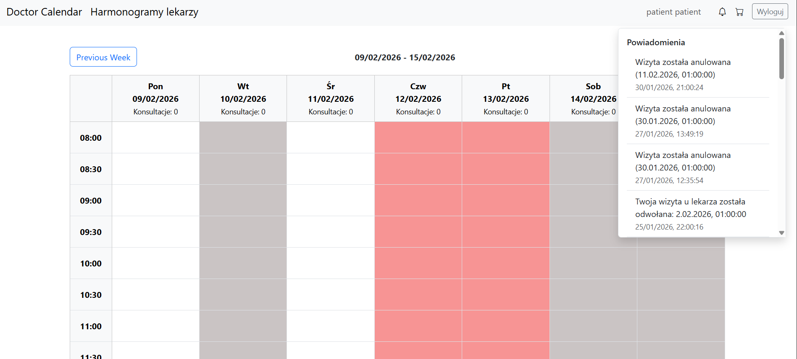
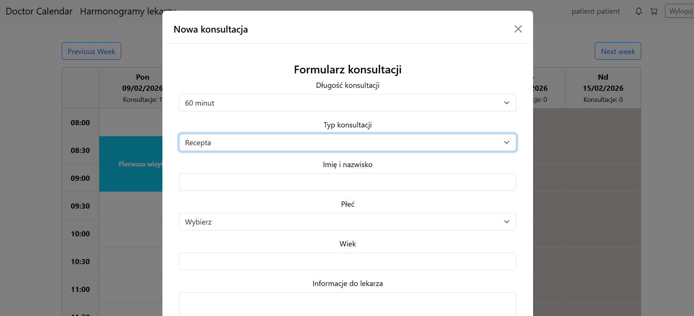
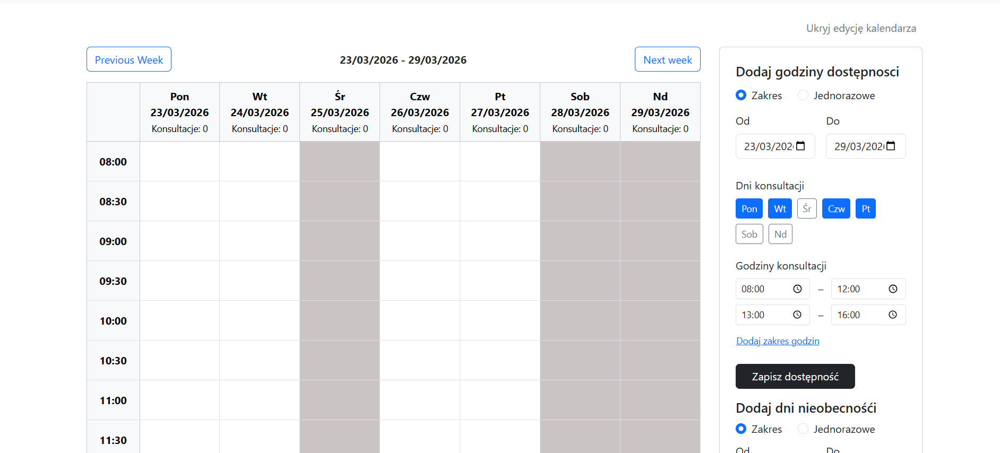

# Doctor Appointment Scheduling

Web application for scheduling and managing doctor appointments using a full-stack architecture.

## Project Overview

This project is a full-stack doctor appointment scheduling system that enables patients to register and book appointments and enables healthcare providers to manage schedules efficiently. It includes a frontend user interface and backend API for authentication and appointment management.

## Features

### Patients functionality:
 - Patient registration and authentication
 - Browsing available doctors, their schedules and other patient's comments
 - Booking appointments and canceling them, as well as providing doctors with additional notes and files
 - Viewing all appointments
 - Getting notified whenever the appointment's been cancelled

### Doctor functionality:
 - Managing schedules, availability and absences
 - Viewing booked appointments
 - Viewing comments about them

### Admin functionality:
 - Registering new doctors
 - Banning users
 - Browsing all users

### Core functionality:
 - RESTful API - for data and business logic
 - Responsive UI
 - JWT based authentication

## Technology Stack
 ### Frontend:
 - React (TypeScript)
 - Bootstrap

 ### Backend:
- Node.js + Express
- Rest API

### Database:
- MongoDB

## Project Structure
```

doctor-appointment-scheduling/
├── backend/
│ ├── src/
│ │ ├── controllers/ 
│ │ ├── middleware/ 
│ │ ├── models/ 
│ │ ├── routes/
│ │ ├── services/
│ │ ├── utils/
│ │ ├── app.js
│ │ ├── db.js
│ │ └── socket.js
│ ├── package.json
│
├── frontend/
│ ├── src/
│ │ ├── Admin/ 
│ │ ├── Availability/ 
│ │ ├── Calendar/ 
│ │ ├── Comments/
│ │ ├── Consultations/
│ │ ├── Notifications/
│ │ ├── Providers/
│ │ ├── Users/
│ │ ├── Views/
│ │ ├── App.tsx
│ │ ├── DoctorCalendarRoute.tsx
│ │ ├── ProtectedRoute.tsx
│ │ └── main.tsx
│ ├── public/
│ ├── package.json

```

## Installation & Setup

Clone this repository
```
git clone https://github.com/nkucht4/doctor-appointment-scheduling.git
cd doctor-appointment-scheduling
```

Install dependencies
```
cd backend
npm install
cd ../frontend
npm install
```

Run locally
```
cd backend
node src/app.js

cd ../frontend
npm run dev
```

## Screenshots
### Patient View


### Doctor View

